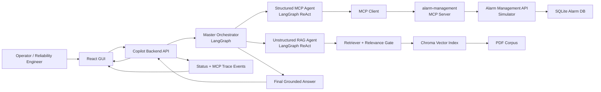

# Architecture Diagram

```mermaid
flowchart LR
  User["Operator / Reliability Engineer"] --> GUI["React GUI"]
  GUI --> Backend["Copilot Backend API"]
  Backend --> Master["Master Orchestrator<br/>LangGraph"]

  Master --> Structured["Structured MCP Agent<br/>LangGraph ReAct"]
  Structured --> MCPClient["MCP Client"]
  MCPClient --> MCPServer["alarm-management<br/>MCP Server"]
  MCPServer --> AlarmAPI["Alarm Management API<br/>Simulator"]
  AlarmAPI --> SQLite["SQLite Alarm DB"]

  Master --> Unstructured["Unstructured RAG Agent<br/>LangGraph ReAct"]
  Unstructured --> Retriever["Retriever + Relevance Gate"]
  Retriever --> Chroma["Chroma Vector Index"]
  Chroma --> Corpus["PDF Corpus"]

  Master --> Final["Final Grounded Answer"]
  Final --> Backend
  Backend --> GUI

  Backend --> Trace["Status + MCP Trace Events"]
  Trace --> GUI
```

This diagram is provided as Mermaid source so it can be rendered by GitHub or
exported to PNG for final submission if required.
