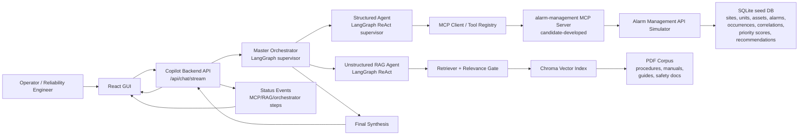

# Architecture

Alarm Copilot is split into a frontend, a copilot backend, two specialist agent
paths, a candidate-developed MCP server, an Alarm Management API simulator, and
a document RAG pipeline.

## System Diagram

## Request Flow

1. The user asks a natural-language question in the React GUI.
2. The GUI sends the question to `POST /api/chat/stream`.
3. The backend passes the question and previous-turn context to the master
   orchestrator.
4. The master orchestrator reads the MCP and RAG capability context and decides
   whether to call:
   - the structured MCP agent,
   - the unstructured RAG agent,
   - or both.
5. Independent tasks are dispatched in parallel through LangGraph `Send`.
6. Sequential tasks are dispatched in later rounds when one path depends on
   another, such as using structured output to discover a procedure ID before
   retrieving document guidance.
7. The structured agent discovers and invokes MCP tools against the
   `alarm-management` MCP server.
8. The MCP server performs authenticated API calls to the Alarm Management API
   simulator and maps API responses/errors into typed MCP results.
9. The unstructured agent retrieves relevant document evidence from Chroma,
   applies document-level deduplication and relevance gating, and returns cited
   passages.
10. The master orchestrator synthesizes a final answer from observations.
11. The backend normalizes the answer into GUI fields: headline, paragraphs,
    summary, likely causes, recommendations, citations, and MCP trace.
12. The GUI displays the answer and the right-side evidence/MCP trace rail.

## LangGraph Structure

### Master Orchestrator

The master graph has four logical nodes:

- `supervisor`: chooses `dispatch` or `answer`.
- `dispatch`: fans out structured/unstructured tasks in parallel where possible.
- `collect`: accumulates observations and decides if another round is needed.
- `finalize`: produces the final grounded response from available observations.

The master uses previous-turn context only to resolve follow-up references. It
does not treat previous answers as fresh evidence; it calls the relevant tools
again when current evidence is needed.

### Structured Agent

The structured graph is a ReAct-style supervisor over MCP tools:

- `structured_supervisor`: plans the next MCP calls.
- `tools`: invokes one or more MCP tools and records observations.
- `structured_finalize`: extracts the final structured evidence package.

It can call:

- `search_assets`
- `get_asset_metadata`
- `get_alarms`
- `get_alarm_summary`
- `correlate_alarms`
- `score_alarm_priority`
- `get_operator_recommendations`

### Unstructured Agent

The unstructured graph retrieves and reasons over documentation:

- supervisor decides retrieval needs,
- retrieval tool searches the Chroma index,
- relevance gate filters weak matches,
- final response includes citations and low-confidence handling.

## Data Boundaries

| Boundary | Description |
| --- | --- |
| GUI to backend | JSON/SSE over local HTTP |
| Backend to MCP server | MCP client invocation; no direct Alarm API calls in orchestration |
| MCP server to Alarm API | Authenticated HTTP with trace metadata |
| RAG path | Local document index and PDF corpus |
| Simulator persistence | SQLite seed database |

## Observability

The UI and backend expose:

- request/conversation identifiers,
- MCP tool name and server,
- status, duration, attempts and HTTP status,
- raw request/response inspection,
- retrieval score and document identifiers,
- status steps as each MCP/RAG operation completes.

## Failure Handling

- MCP errors are mapped to structured tool errors.
- Partial tool failure marks an answer degraded rather than always aborting.
- Retrieval no-result or low-confidence cases produce an explicit low-confidence
  response.
- The GUI shows retry controls and error states.
